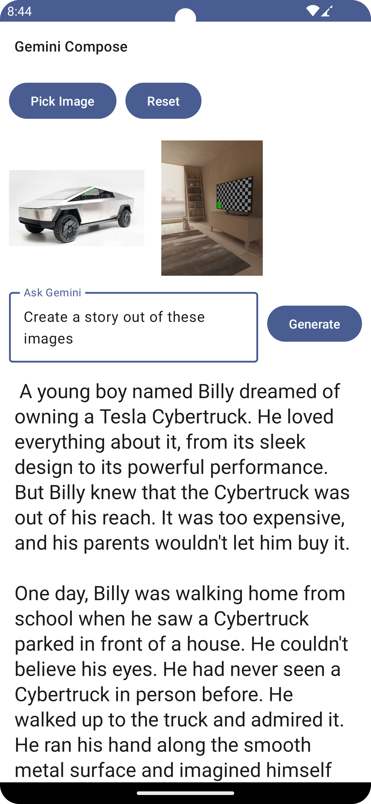

# Playing with GEMINI

Compose app implementing Google's Gemini Pro Model (Text and Image)

### Supported Platforms: 
* Android

[Video Demo](demo/Screen_recording_20231229_204120.mp4)

## What's Google Gemini KMP?
Google Gemini KMP is a Kotlin Multiplatform Mobile project that brings the power of Kotlin to both Android and iOS platforms. It's designed to demonstrate the versatility and efficiency of Kotlin Multiplatform, allowing you to write shared code for both platforms without sacrificing the native experience.

## Create your KMM project with Compose Wizard
[Compose Multiplatform Wizard](https://terrakok.github.io/Compose-Multiplatform-Wizard/)

## Helpful Links for Google Gemini Pro
* [Introduction](https://deepmind.google/technologies/gemini/#introduction)
* [Using Generative Model](https://ai.google.dev/tutorials/android_quickstart)
* [Using Rest API](https://ai.google.dev/tutorials/rest_quickstart)

